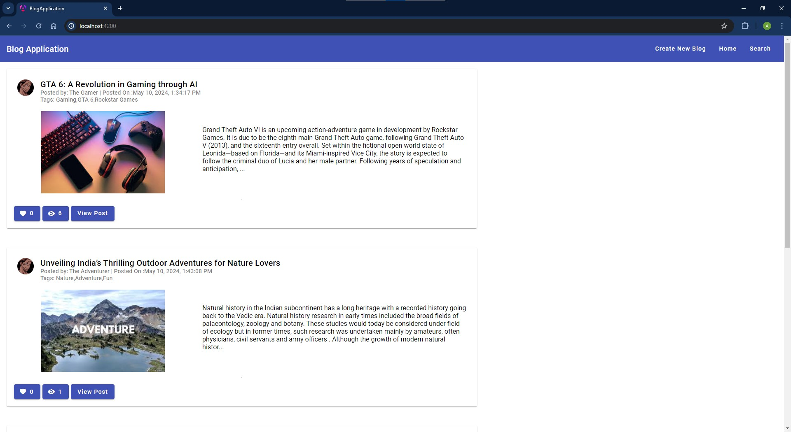

# Blog-Application
A full-stack blogging website developed using Angular and Spring boot.

**Technologies Utilized :**  
**Front-End ->** HTML, CSS, Angular Material, Angular.\
**Back-End  ->** Spring Boot, Hibernate, MySQL.\
\
**Project Description :** This is a simple blogging website where the users share their experiences by posting blogs. The Users can create new blogs, view a blog, like the blog and search for specific blogs by their name or their category.
\
\
**Create A New Blog**:

\
\
**Homepage**:

\
\
**View Blog**:

\
\
**Like A Blog**:

\
\
**Search Blog Page**:

\
\
**Showing Searched Blogs**:

